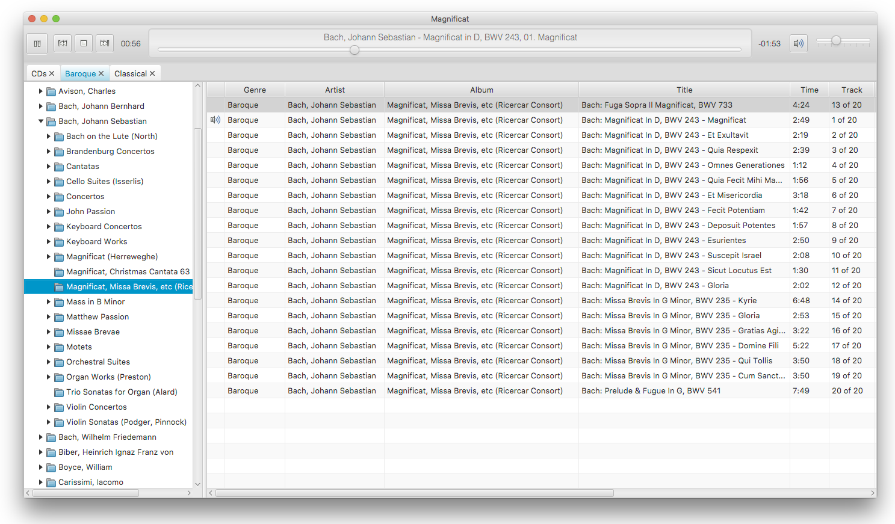

# Magnificat
Magnificat may one day become a magnificent cataloguing app for classical music enthusiasts with large CD collections to organise. Version 1.0 has now been released and you can [download installers for Windows and Mac here](https://github.com/mfearby/magnificat/releases/tag/v1.0). 

I think it's time to restart Magnificat (again!) as a Kotlin project. Java doesn't do anything for me anymore, and since my new job is mostly Kotlin/React, then it makes sense for me to be tinkering at home in Kotlin instead of trying to motivate myself to touch Java again.

The name "Magnificat" is a play on the first line of the popular sacred choral work which begins "Magnificat anima mea Dominum" (which is typically [translated](https://en.wikipedia.org/wiki/Magnificat#Latin_and_Anglican_translation) into English as "My soul doth magnify the Lord"). It lends itself well to what I hope might one day be a magnificent cataloguing app, and my cat ("Peanut") is magnificent as well ;-)

It is a cross-platform Java/JavaFX 15 application for which I use [IntelliJ IDEA](https://www.jetbrains.com/idea/) to edit/test/debug before releasing it. I may get around to making an Ubuntu Linux package in the not-too-distant future, as well.

## Project Roadmap

This project is only a hobby so the following milestones may take some time to achieve. This project started out in Electron and Ext JS but will now be written in Java FX; the previous version can be seen here: [magnificat-electron](https://github.com/mfearby/magnificat-electron).

### Version 1.0
- Use Java FX to create an interface that allows users to open multiple tabs.
- Allow users to browse/play music on the filesystem.
- Remember the currently playing track when the program closes/reopens.

### Version 1.1
- Allow users to edit tag information.
- Obtain tag details from file names based on user-entered format.

### Version 1.2
- Allow users to rename files based on tag information.
- Remember play count and last date for each track by saving information to a file in the current directory (when browsing/playing music by files and folders, not the iTunes-like column browser).

### Version 1.3
- Ripping CDs to MP3, OGG, and FLAC.
- Use CDDB et al for default tags.
 
### Version 1.4
- Rip CDs to FLAC and transfer existing file names and tag information from user-selected lossless equivalents on hard disk.

### Version 2.0
- Allow users to browse/play music by genre, composer, album, etc (like the column browser in iTunes; requires a database which will need to be updated periodically).
- Save the play count of each track and allow users to enter a star rating.

### Version 2.1
- Add more fields to the database to store things like CD label, conductor, orchestra, soloists, etc.
- More search features for finding music, for example "all CDs on the Decca label".

### Other possible features
- Mini player support (with single-click buttons to switch between both views).
